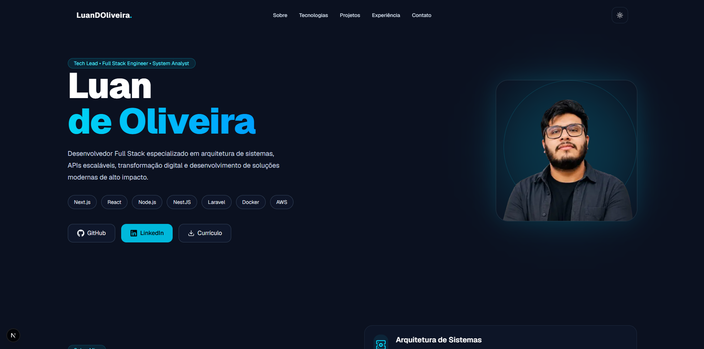

# 🚀 Luan de Oliveira — Portfolio

Portfólio profissional desenvolvido com foco em:
- Desenvolvimento Full Stack
- Arquitetura de Sistemas
- APIs Escaláveis
- Transformação Digital
- Experiência do Usuário

Projeto construído utilizando tecnologias modernas como Next.js, TypeScript, TailwindCSS e Framer Motion.

---

# ✨ Preview



---

# 🧠 Sobre o Projeto

Este projeto foi desenvolvido para apresentar:
- experiência profissional,
- tecnologias dominadas,
- projetos desenvolvidos,
- liderança técnica,
- especialidades em desenvolvimento e arquitetura.

O objetivo é fornecer uma experiência moderna, responsiva e premium para recrutadores e empresas.

---

# 🛠️ Tecnologias Utilizadas

## Frontend
- Next.js 15
- React
- TypeScript
- TailwindCSS
- Framer Motion

## UI & UX
- shadcn/ui
- Lucide Icons
- React Icons
- Glassmorphism
- Responsive Design

## Ferramentas
- Git
- GitHub
- Vercel
- Docker

---

# 📂 Estrutura do Projeto

```bash
app/
components/
 ├── layout/
 ├── sections/
 └── ui/
public/
styles/
```

---

# ⚙️ Instalação

Clone o projeto:

```bash
git clone https://github.com/seuusuario/seurepositorio.git
```

Entre na pasta:

```bash
cd seurepositorio
```

Instale as dependências:

```bash
npm install
```

Execute o projeto:

```bash
npm run dev
```

---

# 🌐 Deploy

O deploy pode ser realizado facilmente utilizando:

- Vercel
- Netlify
- Docker

Deploy recomendado:

```bash
Vercel
```

---

# 📱 Responsividade

O projeto foi desenvolvido com foco em:
- Desktop
- Tablet
- Mobile

---

# 🎨 Features

- ✅ Dark / Light Mode
- ✅ Responsivo
- ✅ Animações com Framer Motion
- ✅ Navbar premium
- ✅ Timeline profissional
- ✅ Seção de projetos
- ✅ Glow effects
- ✅ Smooth Scroll
- ✅ SEO otimizado

---

# 📈 Performance

O projeto foi otimizado para:
- Lighthouse Score
- SEO
- Performance
- Acessibilidade
- Responsividade

---

# 👨‍💻 Autor

## Luan Oliveira

Desenvolvedor Full Stack • Tech Lead • Analista de Sistemas

### Contato

- LinkedIn: https://linkedin.com/in/luandoliveiras
- GitHub: https://github.com/luandoliveira
- Email: luanf.d.silva@gmail.com

---

# 📄 Licença

Este projeto está sob a licença MIT.